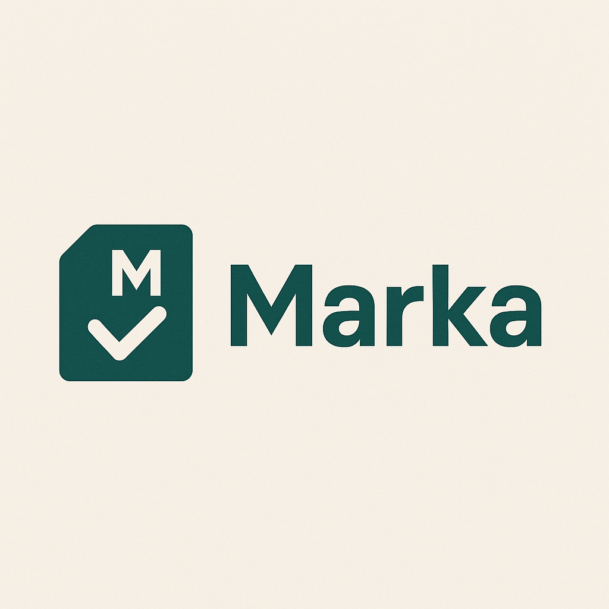

# Marka Report Card Generator

## Empowering Ugandan Schools with Seamless, UNEB-Compliant Report Card Solutions

Welcome to **Marka Report Card Generator**, a revolutionary desktop application crafted to transform how Ugandan schools create, manage, and share student report cards.

Marka is a SaaS-based, offline-capable solution powered by PySide6 and SQLite. It's designed to align perfectly with the Uganda National Examinatin Board (UNEB) grading systems for **Primary Leaving Examination (PLE)**, **Uganda Certificate of education (UCE)**, and **Uganda Advanced Certificate of Education (UACE)**, while embracing the new competency-based curriculu, (CBC). Hosted at [marka.codewithlyee.com](https://marka.codewithlyee.com). It offers a modern, secure and affordable way to streamline academic reporting.

### Why Marka?

In Uganda's evolving educational landscape, schools face challenges in adopting the CBC, managing data offline, and ensuring compliance with UNEB standards. Marka rises to the occasion with:

- **offline-First Design**: Operates fully offline with an isolated database per school, perfect for rural areas with limited internet.

- **UNEB Compliance**: Supports PLE (division-based, aggregates 4-34), UCE (A-E letter grades with continuous Assessment), and UACE (point-based, A-F).

- **Custom Grading**: Extendable grading systems for 200,000 UGX, catering to unique school needs.

- **Parent Engagement**: Multilingual report cards (English, Luganda, Swahili) and a parent portal for easy access.

- **User-friendly Interface**:Excel-like data entry and customizable templates make reporting a breeze, even for non-technical users.

### More information

Email: [info@codewithlyee.com](mailto:info@codewithlyee.com)
HelpDesk: [marka.codewithlyee.com/support](https://marka.codewithlyee.com/support)
Docs: [docs.marka.codewithlyee.com](https://docs.marka.codewithlyee.com)

## License

Copyright (c) 2025 Kasim Lyee. All rights reserved.
Unauthorized distribution or modification is prohibited. Contact the developer for licensing inquiries.
